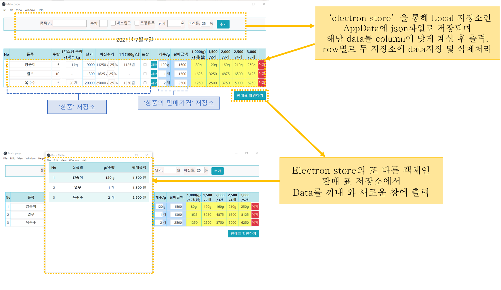

# [fruit-veggie] Electron 상품 단가계산 GUI 프로그램
### 사용기술 및 개발환경
- Window 10
- Electron 13.1
- Node.js 14
- JavaScript ES6
- jQuery 3.6
- HTML
- CSS
- Git
- GitHub
- VSCode
<br/>

### 화면구성 및 작동방식

## Prerequisites
node.js installed

```
npm install

npm start
```

